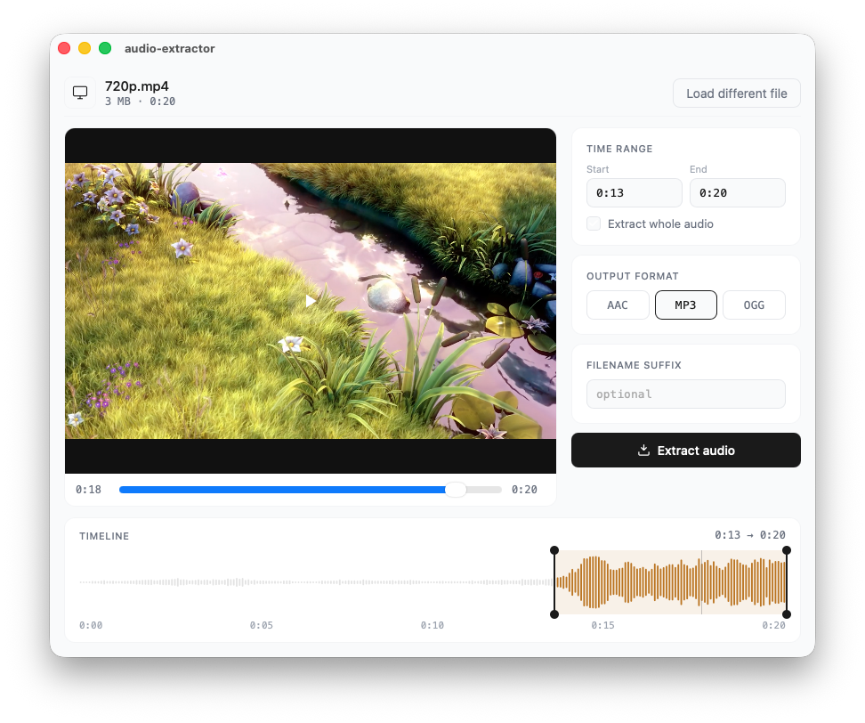

# AudioSnip

[](https://github.com/nikbucher/audio-snip/actions/workflows/build.yml)

A cross-platform desktop app to extract audio from video files using FFmpeg, built with Tauri 2 and Rust.

## Features

- Extract audio from video files (MP4, MOV, AVI, MKV, WebM)
- Support for AAC, MP3, and OGG output formats
- Extract entire audio track or specific time ranges
- Waveform timeline with draggable range handles
- In-app video preview
- Async extraction with progress reporting and cancellation
- Codec-aware optimization (stream copy when source matches target format)



## Installation

### Homebrew (macOS)

```sh
brew install --cask nikbucher/tap/audio-snip
```

This automatically installs FFmpeg as a dependency.

### Pre-built binaries

Download the latest version for your platform from [GitHub Releases](https://github.com/nikbucher/audio-snip/releases):

| Platform | Architecture  | Download                         |
|----------|---------------|----------------------------------|
| macOS    | Apple Silicon | `AudioSnip_x.y.z_aarch64.dmg`    |
| macOS    | Intel         | `AudioSnip_x.y.z_x64.dmg`        |
| Windows  | x64           | `.msi` installer or `.exe` setup |
| Windows  | ARM64         | `.msi` installer or `.exe` setup |
| Linux    | x64           | `.AppImage`, `.deb`, or `.rpm`   |

**Note:** This application requires FFmpeg to be installed on your system. See
the [FFmpeg Installation](#ffmpeg-installation) section below.

**macOS:** The app is not notarized. After installing from a `.dmg`, remove the quarantine flag:

```sh
xattr -d com.apple.quarantine /Applications/AudioSnip.app
```

## FFmpeg Installation

When installing via Homebrew cask, FFmpeg is included automatically. For pre-built binaries,
install FFmpeg manually:

### macOS

```sh
brew install ffmpeg
```

### Windows

1. Download FFmpeg from [https://ffmpeg.org/download.html](https://ffmpeg.org/download.html)
2. Extract the ZIP file and move the folder to a location like `C:\ffmpeg`
3. Add FFmpeg to your system PATH:
    - Open Start Menu and search for "Environment Variables"
    - Click «Environment Variables» and find `Path` under System variables
    - Add the path to the `bin` folder (e.g., `C:\ffmpeg\bin`)
    - Click OK and restart any Command Prompt windows
4. Verify by typing `ffmpeg -version` in Command Prompt

### Linux

Install via your package manager:

```sh
# Ubuntu/Debian
sudo apt update
sudo apt install ffmpeg

# Fedora
sudo dnf install ffmpeg

# Arch Linux
sudo pacman -S ffmpeg
```

Verify installation by running `ffmpeg -version` and `ffprobe -version` in your terminal or command prompt.

**Note:** FFmpeg is licensed under the LGPL/GPL. When using this application, you are responsible for complying
with FFmpeg's license terms. See [FFmpeg Legal](https://ffmpeg.org/legal.html) for more information.

## Development

### Prerequisites

- Install [Rust](https://www.rust-lang.org/tools/install)
- Install [Node.js](https://nodejs.org/) (LTS version recommended)
- Install FFmpeg (see [FFmpeg Installation](#ffmpeg-installation) section)

### Getting Started

```sh
git clone https://github.com/nikbucher/audio-snip.git
cd audio-snip
npm install
cargo tauri dev
```

## Building for Production

1. **Build the App:**
   ```sh
   cargo tauri build
   ```

2. **Distribute the App:**
    - The app will be built in the `src-tauri/target/release` directory.
    - For bundled applications (installers, DMG, etc.), check the `src-tauri/target/release/bundle` directory.

## Releasing

To create a new release, push a version tag:

```sh
git tag -a vX.Y.Z -m "vX.Y.Z"
git push origin vX.Y.Z
```

This triggers the GitHub Actions release workflow, which automatically builds artifacts for all platforms and creates a GitHub release. The version in the artifact filenames is derived from the git tag.

## Documentation

- [Changelog](CHANGELOG.md)
- [Use case specifications](docs/use_cases/)
- [Contributing](CONTRIBUTING.md)

## License

[Unlicense](LICENSE)
